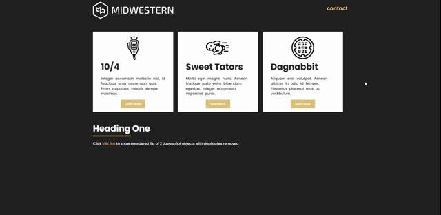

# Midwestern Landing Page

Midwestern Landing Page is the client-side of a technical challenge for Midwestern Interactive to create a mock landing page built using NextJS with an existing server in Firebase.

This web application allows users to populate a JSON list and indicate if the list is already showing. Users may also use the contact form with user data
stored in a dynamic Firebase Collection.



## Quick Start 🚀

### Development server

To get started, just clone the repository and run `npm install && npm run dev`:

    git clone https://github.com/iaincollins/nextjs-starter.git
    npm install
    npm run dev

Note: If you are running on Windows run install --noptional flag (i.e. `npm install --no-optional`) which will skip installing fsevents.

### Building and deploying in production

If you wanted to run this site in production, you should install modules then build the site with `npm run build` and run it with `npm start`:

    npm install
    npm run build
    npm start

You should run `npm run build` again any time you make changes to the site.

Note: If you are already running a webserver on port 80 (e.g. Macs usually have the Apache webserver running on port 80) you can still start the example in production mode by passing a different port as an Environment Variable when starting (e.g. `PORT=3000 npm start`).

## Technical Challenge
This is a simple challenge to assess a base skill set and architectural mindset.
Complete to the best of your ability, if you have any questions reach out your contact.

You will find all necessary assets provided in this repository.

Once complete, place your codebase in a github repository and provide the link your contact at Midwestern.

### 1. Front-end Challenge
Any framework or package may be used in addition to any that may have been requested by your contact.

- Programmatically build out both layouts using HTML/CSS/SASS/JS or any other stack/framework mentioned
  by your contact, see screenshots and [Figma](https://api.mwi.dev/figma) prototype for what the
  finished product should look like.
  - Desktop and mobile views are available from the left side menu in [Figma](https://api.mwi.dev/figma)
  - Scale elements/sections as necessary for content breaks in a responsive manner.
  - **Fonts**: https://fonts.google.com/specimen/Poppins
    - Bold
    - Medium
  - **Primary Colors**:
    - Gold: #DEBF79
    - Dark Gray (background): #222222
    - Mid Gray (text): #858585
    - Light Gray (inputs): #F5F5F5
    - Red: #800000
- At the bottom of the mock up there is a Javascript puzzle. Please use the following data.

Object 1
- Matt Johnson
- Bart Paden
- Ryan Doss
- Jared Malcolm

Object 2
- Matt Johnson
- Bart Paden
- Jordan Heigle
- Tyler Viles

Result Object
- Matt Johnson
- Bart Paden
- Ryan Doss
- Jared Malcolm
- Jordan Heigle
- Tyler Viles

### 2. Integration Challenge
We've developed a very basic API that allows you pull content for the sections in the design.

Please use the following endpoints to populate each of the Lorem Ipsum sections as well as submitting the contact form.

#### Base URL
https://api.mwi.dev

#### Content Sections
- GET `/content/{page}` {page} can be `home` or `contact`

Will return an array of JSON objects containing a unique title and description for each section of the design.

Images are not provided from the API, please hardcode the urls for these.

**Example Response**
```json
{
  "success": true,
  "data": [
    {
      "id": 1,
      "page_id": 1,
      "title": "Some Title",
      "content": "Some chunk of text from the API",
      "page": {
        "id": 1,
        "label": "home",
        "name": "Home",
        "created_at": "timestamp",
        "updated_at": "timestamp"
      },
      "created_at": "timestamp",
      "updated_at": "timestamp"
    }
  ]
}
```

#### Contact Form
- POST `/contact`

Accepts a form data object with all the key/value pairs from the form.

**Example Payload**
```json
{
  "first_name": "First",
  "last_name": "Last",
  "title": "Title",
  "email": "some@email.com",
  "message": "Message content text"
}
```

### 3. Back-end Challenge
This will allow the client front-end to request content for all Lorem Ipsum sections as well as submit and store results from the contact form.

- Build a basic, non-authenticated API
- Setup up a DB of your choosing (MySQL, Postgres etc.)
- Write migrations for database table and seeders for housing Lorem Ipsum content
- Write migrations for database table to store results of the contact form
- Create GET endpoint that returns content from the DB for each of the Lorem Ipsum sections (URL path up to your discretion)
  - Content for title
  - Content for paragraph
  - Images src may be hardcoded, or you may store URL in DB
- Create POST endpoint for storing the results of the contact form in the DB on submit (URL path up to your discretion)

### Resources
- [Figma](https://api.mwi.dev/figma)
- [Next.js by Vercel - The React Framework](https://nextjs.org/)
- [NestJS - A progressive Node.js framework](https://nestjs.com/)
- [Laravel](https://laravel.com)
